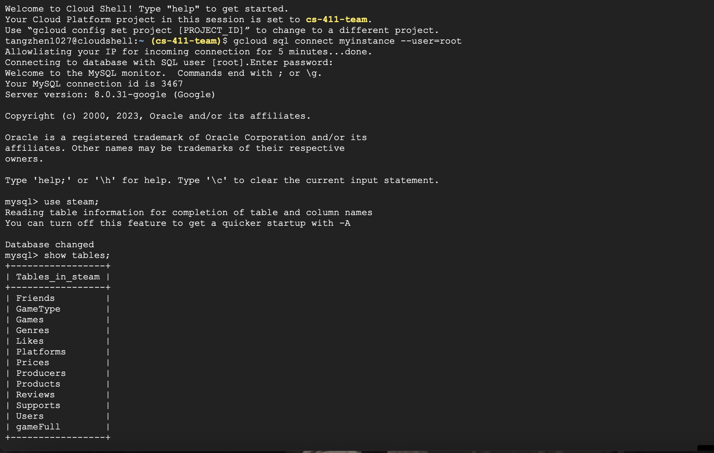
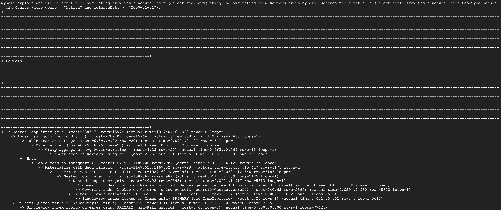
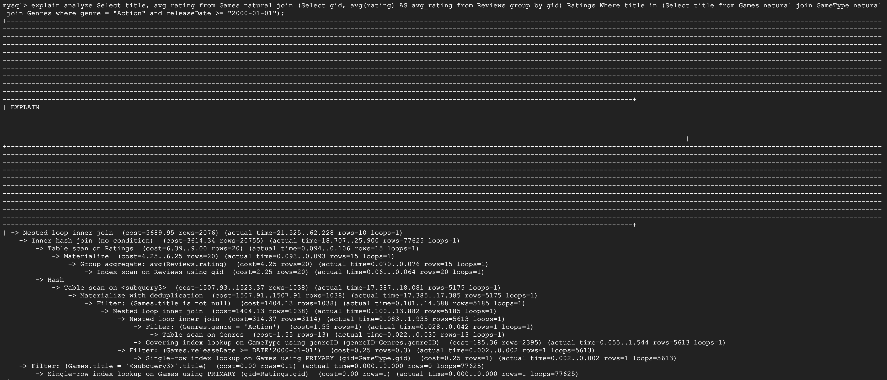
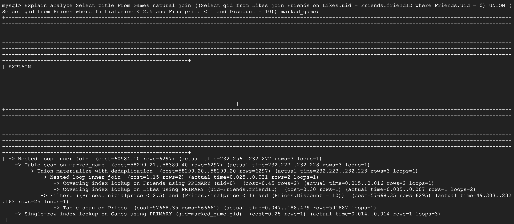
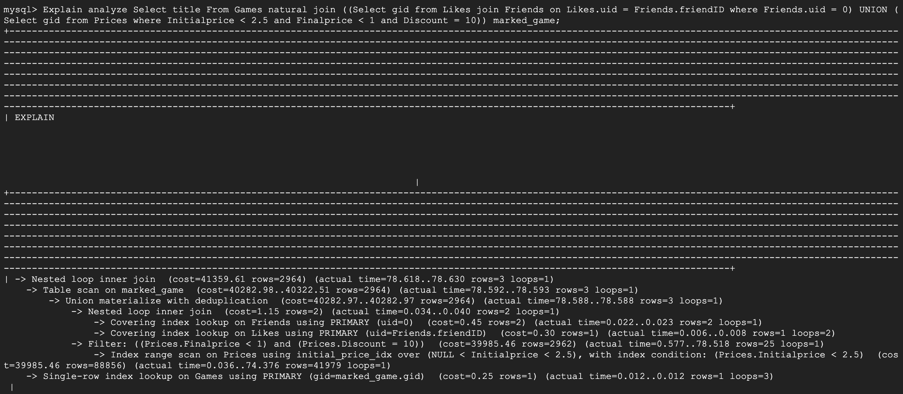

# Database Implementation and Indexing

## Part 1 Database Implementation

### GCP Database Implementation


### DDL Commands

```mysql=
Create Table Users(
    uid int primary key,
    username varchar(50),
    password varchar(50)
);
```

```mysql=
Create Table Games(
    gid int primary key, 
    title varchar(255), 
    releaseDate varchar(100),
    introduction varchar(255), 
    link varchar(255)
);
```

```mysql=
CREATE TABLE Genres(
    genreID INT,
    genre VARCHAR(30),
    PRIMARY KEY (genreID)
);
```

```mysql=
CREATE TABLE Platforms(
    platformID INT,
    platformName VARCHAR(255),
    PRIMARY KEY (platformID)
);
```

```mysql=
CREATE TABLE Producers(
    producerID INT,
    producerName VARCHAR(50),
    PRIMARY KEY (producerID)
);
```

```mysql=
CREATE TABLE Supports(
    gid INT,
    platformID INT,
    PRIMARY KEY (gid, platformID),
    FOREIGN KEY (gid) REFERENCES Games(gid) ON DELETE CASCADE,
    FOREIGN KEY (platformID) REFERENCES Platforms(platformID) ON DELETE CASCADE
);
```

```mysql=
CREATE TABLE GameType(
    gid INT,
    genreID INT,
    PRIMARY KEY (gid, genreID),
    FOREIGN KEY (gid) REFERENCES Games(gid) ON DELETE CASCADE,
    FOREIGN KEY (genreID) REFERENCES Genres(genreID) ON DELETE CASCADE
);
```

```mysql=
CREATE TABLE Products(
    gid INT,
    producerID INT,
    PRIMARY KEY (gid),
    FOREIGN KEY (gid) REFERENCES Games(gid) ON DELETE CASCADE,
    FOREIGN KEY (producerID) REFERENCES Producers(producerID) ON DELETE CASCADE
);
```

```mysql=
Create Table Friends(
    uid int, 
    friendID int, 
    primary key(uid, friendID), 
    Foreign Key(uid) References Users(uid) ON DELETE CASCADE, 
    Foreign Key(friendID) References Users(uid) ON DELETE CASCADE
);
```

```mysql=
Create Table Likes(
    uid int, 
    gid int, 
    primary key(uid, gid), 
    Foreign Key(uid) References Users(uid) ON DELETE CASCADE, 
    Foreign Key(gid) References Games(gid) ON DELETE CASCADE
);
```

```mysql=
Create Table Reviews(
    uid int, 
    gid int, 
    rating float, 
    content varchar(255), 
    primary key(uid, gid), 
    Foreign Key(uid) References Users(uid) ON DELETE CASCADE, 
    Foreign Key(gid) References Games(gid) ON DELETE CASCADE
);
```
```mysql=
Create Table Prices(
    Date VARCHAR(100),
    Initialprice float,
    Finalprice float,
    Discount float,
    gid int,
    Primary KEY(gid, Date),
    FOREIGN KEY (gid) REFERENCES Games(gid) ON DELETE CASCADE
);
```


### Table Counts
**Users:**
```console
mysql> select count(*) from Users;
+----------+
| count(*) |
+----------+
|       10 |
+----------+
1 row in set (0.01 sec)
```
**Games:**
```console
+----------+
| count(*) |
+----------+
|    13304 |
+----------+
1 row in set (0.01 sec)
```
**Genres:**
```console
mysql> select count(*) from Genres;
+----------+
| count(*) |
+----------+
|       13 |
+----------+
1 row in set (0.00 sec)
```

**Platforms:**
```console
+----------+
| count(*) |
+----------+
|        3 |
+----------+
1 row in set (0.01 sec)
```

**Producers:**
```console
mysql> select count(*) from Producers;
+----------+
| count(*) |
+----------+
|     8734 |
+----------+
1 row in set (0.00 sec)
```

**Supports:**
```console
mysql> select count(*) from Supports;
+----------+
| count(*) |
+----------+
|    20905 |
+----------+
1 row in set (0.00 sec)
```

**Gametype:**
```console
mysql> select count(*) from GameType;
+----------+
| count(*) |
+----------+
|    31896 |
+----------+
1 row in set (0.00 sec)
```

**Products:**
```console
+----------+
| count(*) |
+----------+
|    12668 |
+----------+
1 row in set (0.01 sec)
```

**Friends:**
```console
mysql> select count(*) from Friends;
+----------+
| count(*) |
+----------+
|       20 |
+----------+
1 row in set (0.01 sec)
```

**Likes:**
```console
mysql> select count(*) from Likes;
+----------+
| count(*) |
+----------+
|       10 |
+----------+
1 row in set (0.00 sec)
```


**Prices (weak):**
```console
mysql> select count(*) from Prices;
+----------+
| count(*) |
+----------+
|   725269 |
+----------+
1 row in set (0.07 sec)
```

**Reviews (weak):**
```console
mysql> select count(*) from Reviews;
+----------+
| count(*) |
+----------+
|       20 |
+----------+
1 row in set (0.00 sec)
```


### Advanced Queries
#### Query 1
This query outputs the title and average ratings of games whose genre is "Action" and is released after 2000-01-01.

```mysql=
Select title, avg_rating
From Games natural join (Select gid, avg(rating) AS avg_rating from Reviews group by gid) Ratings
Where title in (Select title from Games natural join GameType natural join Genres where genre = "Action" and releaseDate >= "2000-01-01");

```
##### Results

Please note output of this query was less than 15 records.

#### Query 2
This query outputs the game titles that are liked by at least one of the current user's friend or whose InitialPrice is less than 2.5, FinalPrice is less than 1 and discount is equal to 10. Note that the specific numbers used in this query can be changed based on different users and custom settings.
```mysql=
Select title
From Games natural join
((Select gid from Likes join Friends on Likes.uid = Friends.friendID where Friends.uid = 0)
UNION
(Select gid from Prices where Initialprice < 2.5 and Finalprice < 1 and Discount = 10)) marked_game;

```
##### Results

Please note output of this query was less than 15 records.

## Part 2 Indexing

### Query 1


As shown by the EXPLAIN ANALYZE command, Query 1 has a default cost of about 5700. 

#### Indexing Design 1
We first chose to create an index on *genre* because it is one of the two attributes that Query 1 filters by in the second subquery.
```mysql=
CREATE INDEX idx_Genres_genre ON Genres(genre);
```

By creating an index on the *genre* column in the **Genres** table we can clearly see from the output of the EXPLAIN ANALYZE command that the query will execute using an index lookup instead of a table scan of the *genre* column. Effectively, this brings down the overall cost of the query to just 4385.71. This is be considered to be a measurable improvement compared to the original query without indexing.
Creating an index on the *genre* column allows the query to search up specific *genres* that are relevant to the final result instead of having to perform a table scan. This in turn will decrease the cost of the overall query.

#### Indexing Design 2
We then chose to create an index on *releaseDate* because it is one of the other two attributes that Query 1 filters by in the second subquery. 
```mysql=
CREATE INDEX idx_Games_releaseDate ON Games(releaseDate)
```

By creating an index on the *releaseDate* column in the **Games** table we can clearly see from the output of the EXPLAIN ANALYZE command that the query actually performs worse. Specifically, the cost of the entire query increases. As such, creating an index on releaseDate actually worsened query performance indicating that an index should not be put on *releaseDate*.
We think creating an index on the *releaseDate* column decreases performance because most of our games do have a *releaseDate* greater than the *releaseDate* specified. Thus, putting an index on *releaseDate* should either worsen or not change query performance.

#### Indexing Design 3
Looking elsewhere, we chose to create an index on *rating* in the **Reviews** table because it is the column that we group by in Query 1's group by clause. 
```mysql=
CREATE INDEX idx_Reviews_rating on Reviews(rating);
```

As shown from the output of the EXPLAIN ANALYZE command, the cost improved minimally compared to the original query without indexes which indicates that puting an index on releaseDate has a minimal effect on the overall performance of the query. 
For a group by clause, putting an index on the attribute to group by should not improve the query that significantly since during query execution, a full table scan will still be needed as every record needs to be grouped together. Lookup times will be faster, but the majority of the time spent will be going through all the records in the table.

#### Final Index Design
From our index analysis of Query 1, we chose to go with index design 1 where we put an index on the *genre* columns in the **Genres** table because since that was the only one that improved query performance significantly compared to the other index designs.

### Query 2


As shown by the EXPLAIN ANALYZE command, the default cost is 60584 for the whole query and 57668 for the filter in the second subquery. This indicates that the filtering of values contributes a significant portion of the overall query cost. As such, creating an index for each of the attributes in the filter allows the query to search up specific values of those attributes that are relevant to the final result instead of having to perform a table scan. This in turn will decrease the cost of the overall query.

#### Indexing Design 1
We first chose to create an index on *Initialprice* as our first index since it is one of three attributes that appear in the filter of the second subquery of Query 2. 
```mysql=
CREATE INDEX initial_price_idx ON Prices(Initialprice);
```

By creating an index on the *Initialprice* column in the **Prices** table, it can be observed  that the total cost of the query reduces from 60584 to 41359 and the cost of the filter decreases from 57668 to 39985. As such, we can conclude that putting an index on *Initialprice* greatly improves our query's performance and should be included in the final index design.


#### Indexing Design 2
We then chose to create an index on *Finalprice* since it is one of the other three attributes that appear in the filter of the second subquery of Query 2.
```mysql=
CREATE INDEX final_price_idx ON Prices(Finalprice);
```

By creating an index on the *Finalprice* column in the **Prices** table, it can be observed  that the total cost of the query reduces from 60584 to 38065 and the cost of filter decreases from 57668 to 36800. As such, we can conclude that putting an index on *Finalprice* greatly improves our query's performance and should be included in the final index design.

#### Indexing Design 3
Finally, we chose to create an index on *Discount* since it is the last of the three attributes that appear in the filter of the second subquery of Query 2. 

```mysql=
CREATE INDEX discount_idx ON Prices(Discount);
```

Similarly to the other two indexes, we observe that the cost decreases when an index is created on the *Discount* column. Theorectically, this could be due to the fact that we are filtering by an exact value instead of a range of values like the other two attributes. As such, is can be concluded that putting an index on *Discount* will dramatically improve our query's performance.

#### Final Index Design
From our index analysis of Query 2, we chose to go with index design 3 where we put an index on the *discount* column in the **Prices** table because that was the index that improved query performance the most.


